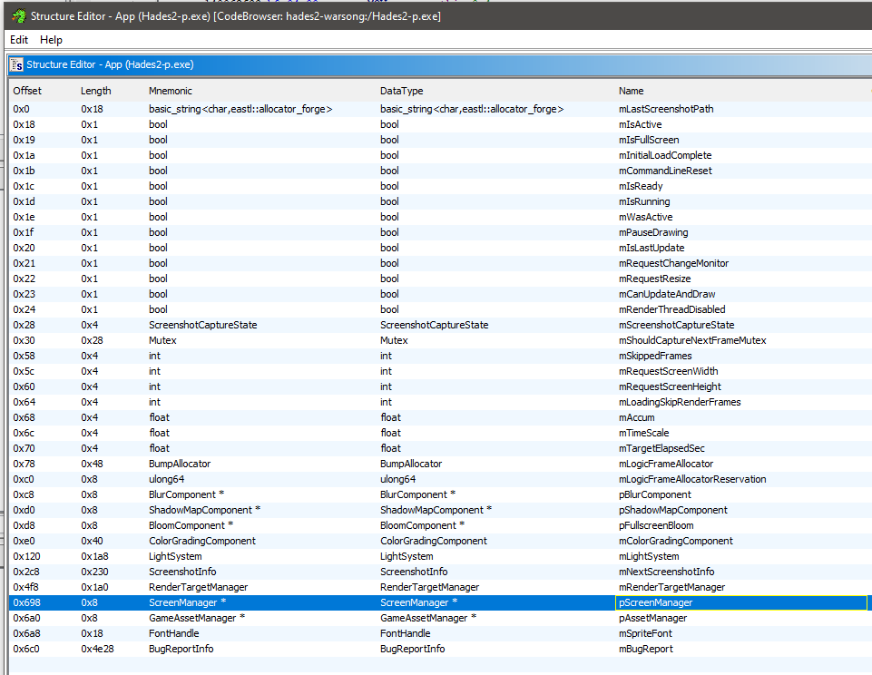
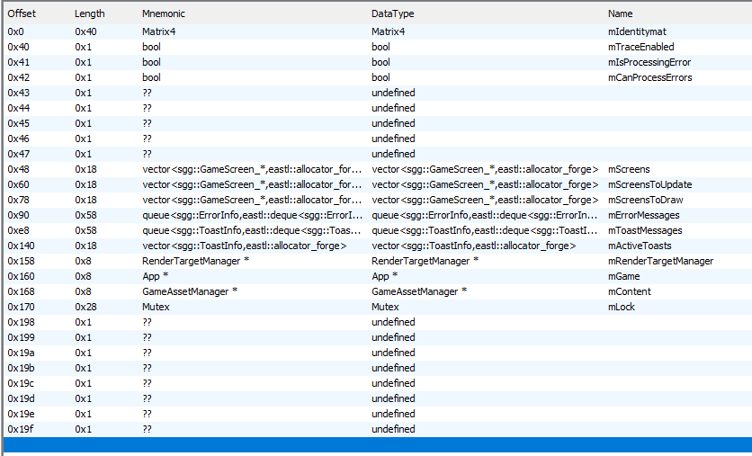
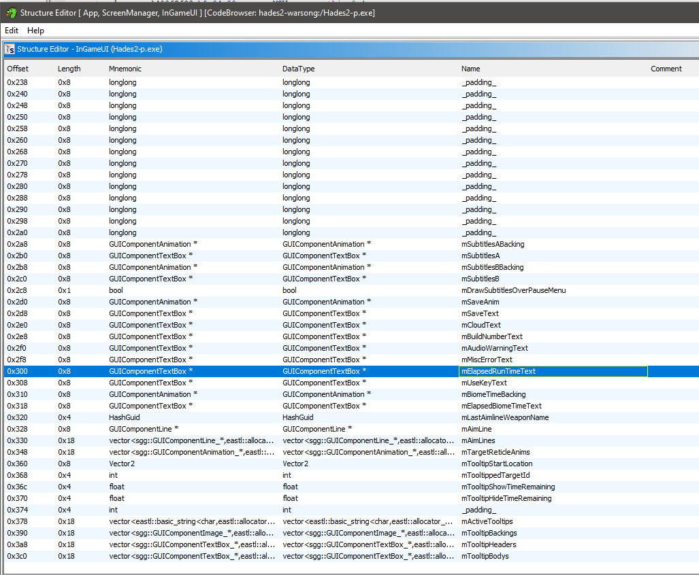
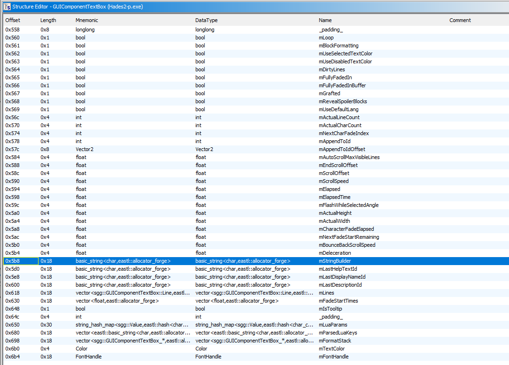
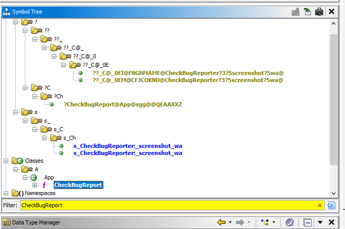
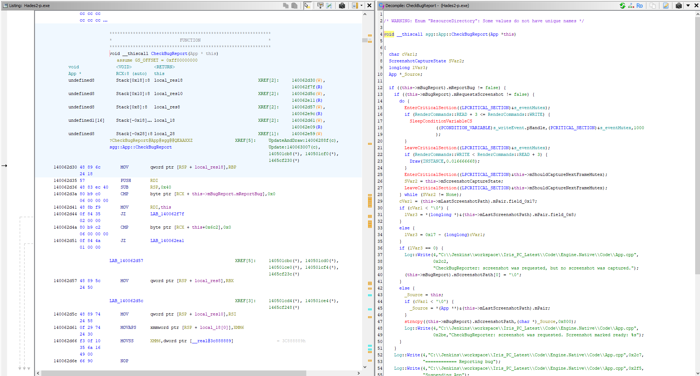
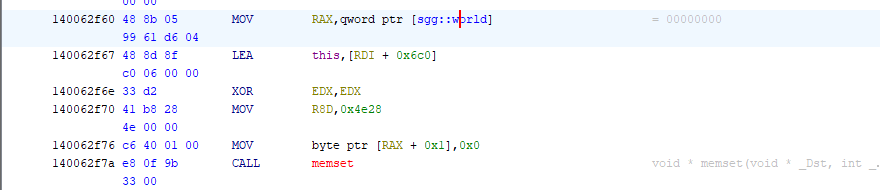
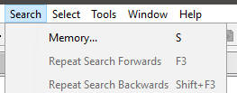
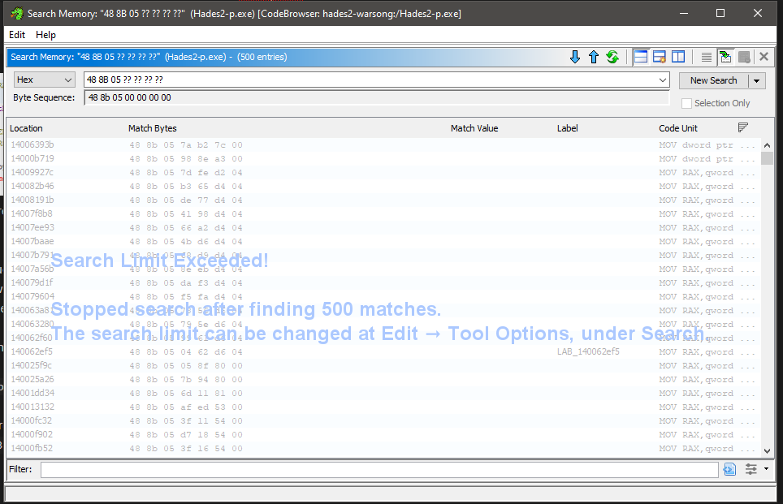
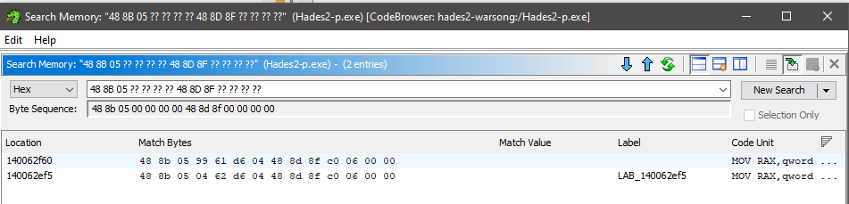

# Downpatching
It can be useful to downpatch the game, for example to decompile a previous version that was known to work with an 
autosplitter, and compare where the values may have come from if the comments are not sufficient.

https://www.makeuseof.com/how-to-downgrade-steam-games/

With future updates the exe might have a bunch of symbols stripped out, which will make downpatching more important. 
e.g. take a look at Hades1.exe decompiled, there is a lot less useful info like nice function names :(

# Decompiling

I've been using Ghidra to decompile the exe, other tools are available.

# Struct offsets

## Simple data - pointers to other types

Using ScreenManager as an example.
This is a previous value, that no longer works after a game patch

```cpp
vars.screen_manager = game.ReadPointer(app + 0x4F0); // // App.pScreenManager
```

Assuming the app value is correct from previous steps, `0x4F0` offset may be incorrect.
Let's look at Ghidra, searching for `App` in the bottom left corner window (Data Type Manager)


It will be under an `sgg/` directory. Double click to open the structure view



**Here we can see that `pScreenManager` is at offset `0x698` - this is the new value to use.**

The data type of pScreenManager is `ScreenManager*`, the `*` denotes that it is a pointer,
so this 8 byte value (length `0x8`) will just be a pointer to where the ScreenManager is in memory.
If you want to see what data the ScreenManager has look at it in Ghidra too:



From there we use mScreens to find the UI, which gives us the timer.

## "Nested types"

Some types will need a bit more digging, for example the elapsed run time text is not so easy to find.
Once we have the InGameUI object from ScreenManager, we want the mElapsedRunTimeText data



But this isn't just a string, it's a `GUIComponentTextBox*`

```cpp
IntPtr runtime_component = game.ReadPointer((IntPtr)vars.game_ui + 0x300); // InGameUI.mElapsedRunTimeText
if (runtime_component != IntPtr.Zero)
{
	/* This might break if the run goes over 99 minutes T_T */
	current.run_time = game.ReadString(game.ReadPointer(runtime_component + 0x5B8), 0x8); // GUIComponentTextBox.mStringBuilder
	if (current.run_time == "PauseScr")
		current.run_time = "0:0.10";
}
}
```

The first line reads the value at the offset `0x300` where `mElapsedRunTimeText` is found,
`game.ReadPointer` means we follow where that value is pointing to in memory.



We then have to read the actual string value from the component at `0x5B8` to read the timer string

# SigScanTargets

Finding these in the first place would not be fun, but updating them is a bit easier.

Lets say the world sigscan is not working

```cpp
// sgg::App::CheckBugReport : MOV RAX,qword ptr [sgg::world]
var world_signature_target = new SigScanTarget(3, "48 8B 05 ?? ?? ?? ?? 48 8D 8F ?? ?? ?? ?? 33 D2 41 B8 ?? ?? ?? ?? C6 40 01 00 E8");
```

We need to look at the function `App::CheckBugReport` in Ghidra.
Search in the middle left window (Symbol Tree)




Somewhere in this function, will be the instruction left in the comment in the autosplitter

```assembly
MOV RAX,qword ptr [sgg::world]
```



Now we just need to create the correct SigScanTarget, vast simplification time,
but good enough to make it seem less like magic.

The assembly code is a mix of instructions, and variables
`MOV RAX` is some instructions that will not change (between game patches anyway)
`qword ptr [sgg::world` will "change" each time we run the exe.

These match up to the hex codes on the left side.
`48 8B 05` = `MOV RAX`
`99 61 d6 04` = `qword ptr [sgg::world]` etc.

`??` is used in the SigScan as wildcards, so we don't know what those values will be.
However, if we just search for `48 8B 05 ?? ?? ?? ??` we will get too many results
(`MOV RAX` will be a very common instruction)

Search memory from the toolbar




...so we need to narrow it down further

the next lines are some instructions and some values that might change, 
`48 8D 8F` = `LEA this`
`C0 06` = 0x6c0
`00 00` = RDI
=> append to our sigscan `48 8D 8F ?? ?? ?? ??`



`MOV RAX ?? ?? ?? ??`, might be very common, but `MOV RAX ?? ?? ?? ?? ` immediately followed by `LEA this, ?? ?? ?? ??`
is much less common, now we only have two instances of it.

In this case just the next two bytes were what we needed, `33 D2` to the end finds only one match this is our sgg::world pointer.

FYI (I think) the 3 in the SigScanTarget instruction is because of which `??` character we want - zero indexed

```cpp
var world_signature_target = new SigScanTarget(3, ...)
```

```
          ⬇
 0  1  2  3  4  5  6 ...
48 8B 05 ?? ?? ?? ?? ...
```